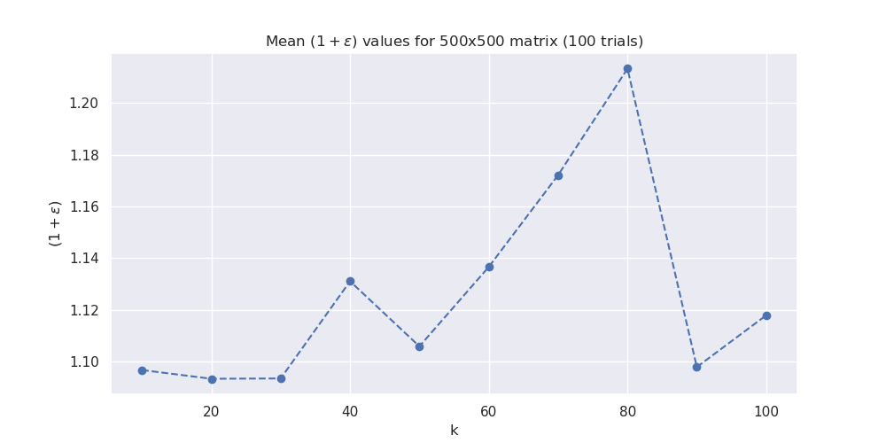

# Input-Sparsity-Time-Low-Rank-Approximation-via-Ridge-Leverage-Score-Sampling

The approximation method in sparse_time_approx.py is analyzed using analyze_sparse_time_approx.py. _{k} \|_{F}^2 \leq (1 + \epsilon) \| A - A_k \|_F^2), where C represents a matrix generated by sub-sampling columns from A and $C_k$ represents the k-rank approximation of C. The following results are plotted using the analyze_sparse_time_approx.py script.

